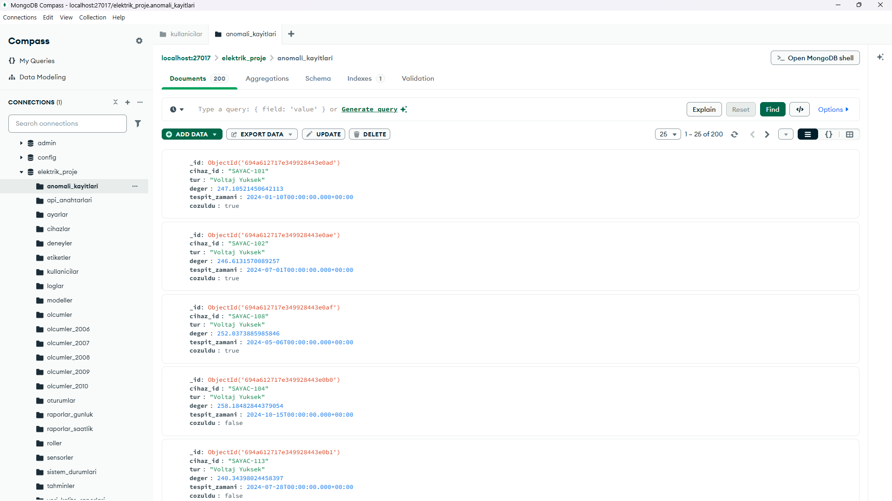
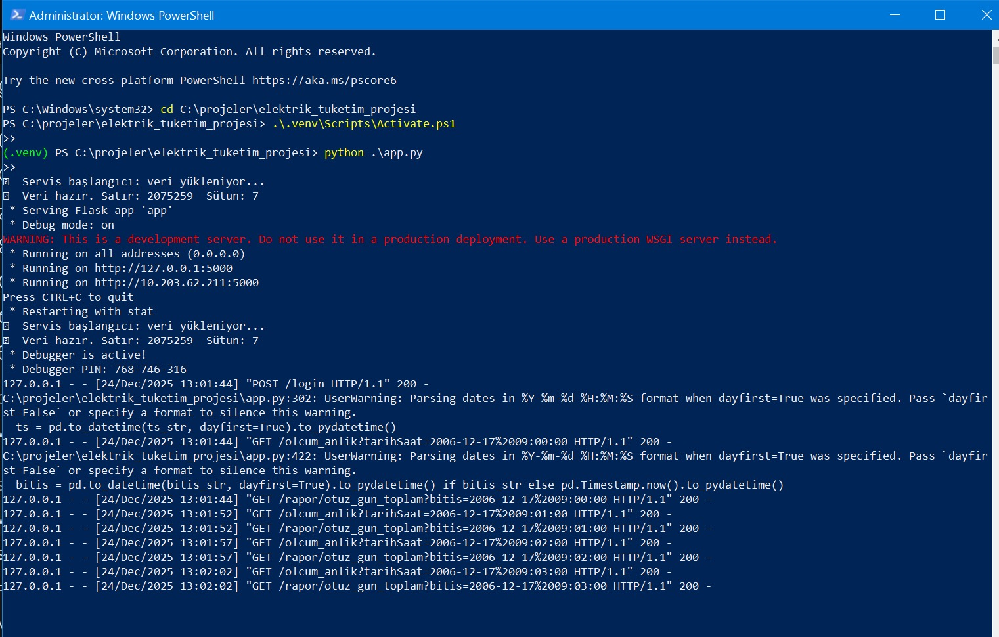

## AKILLI ENERJİ YÖNETİMİ VE FİYAT TAHMİN PROJESİ

### 📌 Projenin Amacı ve Özeti
Bu projenin amacı dakikalık elektrik tüketim verilerinden yararlanarak gelecekteki küresel aktif güç (kW) tüketimini ve bununla çarpılan fiyat tahmini bulmayı amaçlar. Tasarruf etmek için uyarılar barındırır. Büyük Veri (Big Data) ve IoT (Nesnelerin İnterneti) senaryoları için tasarlanmış, MongoDB tabanlı kapsamlı bir enerji yönetim sistemidir. 2 milyondan fazla sensör verisini işleyen, analiz eden ve yapay zeka modelleriyle entegre çalışan ölçeklenebilir bir mimariye sahiptir.

### ✨Öne Çıkan Yetenekler:

🚀 Yüksek Performans: 2.000.000+ satırlık veri seti üzerinde milisaniyeler içinde sorgulama.

📦 Gömülü Veri Modeli: Sensör, lokasyon ve teknik detayların iç içe (Embedded) dokümanlarda tutulması.

📊 Analitik Raporlama: MongoDB Aggregation Framework ile detaylı tüketim analizleri.

🤖 MLOps Entegrasyonu: Eğitilen yapay zeka modellerinin (LSTM, XGBoost) meta verilerinin yönetimi.

### 🛠️Kullanılan Teknolojiler

* Veritabanı: MongoDB (NoSQL)

* Backend & ETL: Python (PyMongo, Pandas)

* Arayüz: Streamlit (Web Dashboard)

* Flask Endpoint Fonksiyonları

* Flutter Mobil Uygulama

* GRPC Servis

* Veri Görselleştirme: Matplotlib / Plotly

* Random Forest Regresyonu (Machine Learning)

* Veri Seti: Household Power Consumption (UCI Machine Learning Repository)

## 🧠 SOA Mimarisinin Detaylı Açıklaması (Servis Odaklı Mimari)

Bu proje bir **Servis Odaklı Mimari (SOA)** yaklaşımıyla geliştirilmiştir.  
Katmanlar birbirinden bağımsızdır ve servisler arası iletişim standart protokollerle sağlanır.

* Servisler ayrı ayrı deploy edilebilir
* REST API, gRPC servisi ve Node.js API ayrı portlarda çalışır
* Mobil istemci sadece API’leri çağırır

| Katman/Servis | Teknoloji | Açıklama |
|---------------|-----------|----------|
| Sunum Katmanı (Mobil) | Flutter | REST/gRPC/NodeJS API ile iletişim |
| REST API | Python + Flask | CRUD, rapor, tahmin servisleri |
| gRPC Servisi | Python + Protobuf | Performans odaklı raporlama |
| Node.js API | Node.js + Express | Alternatif API |
| Makine Öğrenmesi | scikit-learn RandomForest | Tahmin modelleri |
| Veri Deposu | MongoDB | Ölçüm, kullanıcı, tahmin kayıtları |

### 📊Kullanılan Veri Seti Detayları (Machine Learning)

* Veri Seti Adı: Household Power Consumption Dataset

* Kaynak: UCI Machine Learning Repository

* Zaman Aralığı: 2006 – 2010

* Ölçüm Sıklığı: Dakikalık

Kullanılan Temel Alanlar:

* KureselAktifGuc

* KureselReaktifGuc

* Voltaj

* KureselAkim

* AltSayac_1, AltSayac_2, AltSayac_3

* TarihSaat

### 📂 Veritabanı Mimarisi ve Koleksiyon Yapısı (Data-Modeling & MongoDB Compass)

Proje, NoSQL prensiplerine uygun olarak Denormalizasyon ve Embedded Document stratejilerini kullanır.

Koleksiyon Yapısı (20+ Koleksiyon)
Sistem modüler bir yapıya sahiptir:

* olcumler_2006 ... olcumler_2010: Yıllara göre bölümlenmiş (Partitioned) sensör verileri.

* sensorler: IoT cihazlarının teknik detayları ve konum bilgileri.

* modeller: Makine öğrenmesi modellerinin kayıt defteri (Model Registry).

* kullanicilar & roller: Yetkilendirme ve kimlik yönetimi.

* veri_kalite_raporlari: Veri sağlığını izleyen denetim kayıtları.

* veri_kaynaklari: Dış API ve entegrasyon tanımları.

* (Ve loglar, faturalar, cihazlar, bildirimler vb. diğer koleksiyonlar)

### Örnek Veri Modeli (JSON)
"olcumler_2006/2010" koleksiyonlarında kullanılan İç İçe (Nested) yapı örneği:

```python
{
  "_id": ObjectId("64bf..."),
  "zaman": ISODate("2008-01-01T00:00:00Z"),
  "yil": 2008,
  "sebeke": {
    "aktif_guc": 2.58,
    "reaktif_guc": 0.136,
    "voltaj": 241.97,
    "akim": 10.6
  },
  "tuketim_detay": {
    "mutfak": 0,
    "camasirhane": 2,
    "klima_isitici": 18
  }
}
```
### 💾 MongoDB Compass Yapısı


### 📱 Mobil Arayüz
.jpeg)
.jpeg)

### ⚙️ Server'ı açtıktan sonra 5 saniyede 1 çekilen verilerin kanıtı:

